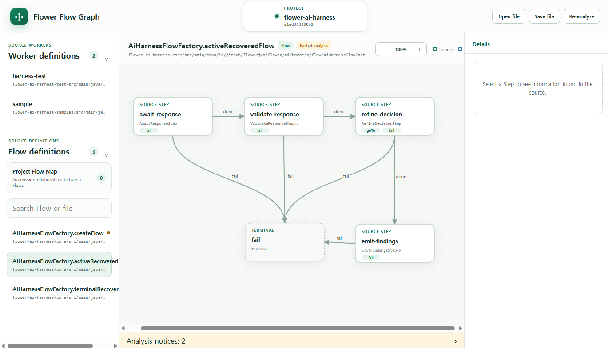
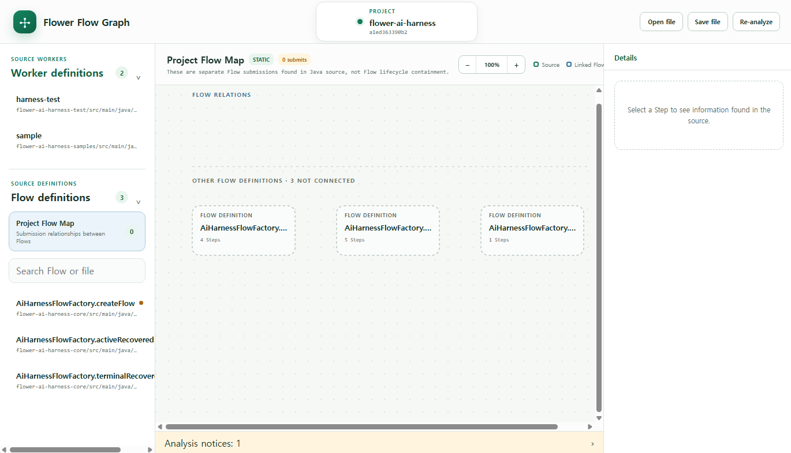

# Flower Flow Graph

Flower Flow Graph turns a Flower project's Java source into a graph that opens
in your browser. It helps you answer simple questions such as:

- Which Workers and Flows are in this project?
- What Steps does a Flow contain, and in what order can they run?
- Which Worker runs a Flow, and does one Flow start another Flow?
- Where in the source code was each item found?

Use it when learning an unfamiliar Flower project or when checking a Flow
structure without reading every factory and Step class first.

The tool only reads the project. It does not change Java code or control a
running Flower Engine. Moving nodes or saving a workspace only changes how the
graph is arranged on your screen.

## Quick start

From the root of a Maven-based Flower project, run:

```powershell
mvn io.github.flowerjvm:flower-flow-graph-maven-plugin:0.1.0:serve
```

The command downloads the tool and opens the graph in your browser. Nothing is
added to the application and the project source is not modified. Press
`Ctrl+C` when you are finished.

## Example

### Flow structure



### Project Flow Map



## What the graph shows

- Worker and Flow definitions found in the project.
- Steps and the transitions that can be confirmed from source code.
- Worker-to-Flow and Flow-to-Flow submission relationships.
- Event subscriptions and internal `stepNo` phases when they can be found.
- Source locations and clear partial markers for anything that could not be
  fully determined.

Select a Worker to see its related Flows, then select a Flow to open its Step
graph. The Project Flow Map shows submission relationships across the project.

## Detailed analysis coverage

- Finds direct `Flow.builder(...).step(...).build()` and
  `EventFlow.builder(...)` chains.
- Scans production Java source sets by default and excludes `src/test`,
  `src/testFixtures`, `src/integrationTest`, and `src/functionalTest`.
- Finds builders stored in a local variable, including dynamic loop-added steps.
- Resolves simple string constants used for flow types and step ids.
- Shows implicit `done` ordering and literal `StepResult.goTo(...)`,
  `finish()`, and `fail()` facts when the Step class is in the scanned source.
- Marks dynamic or unresolved structure as partial instead of guessing.
- Finds Java `Worker.builder(...)` and `EventWorker.builder(...)` declarations.
- Finds `flower.workers` declarations in Spring Boot `application*.yml`,
  `application*.yaml`, and `application*.properties` files.
- Shows source-confirmed Worker-to-Flow submission relationships.
- Shows source-confirmed `Step -> Worker.submit(...) -> Flow` handoffs as
  linked Flow nodes and in a project-level Flow Map.
- Shows event subscriptions, signal use, and source-confirmed internal
  `stepNo` phases when they can be resolved statically.
- Lays out the project Flow Map by submission direction and moves definitions
  without a detected submission relation into a separate lower section.
- Labels conditional and `0..N` submission call sites, and keeps unresolved
  Flow targets visibly partial.
- Serves a loopback-only graph UI.
- Lets a user arrange nodes and save or reopen the source snapshot, positions,
  and zoom levels as a local workspace file.

The current version does not change source code, connect to a running Engine, or
provide operational controls.

A possible future graph-editing workflow is recorded separately in
[Future Flow Editing Concept](docs/FLOW_EDITING_CONCEPT.md). It is not a current
feature.

## Requirements

- Java 17 or newer
- Maven 3.6.3 or newer when using the Maven goal
- No Flower runtime dependency is added to the inspected application

## Modules

- `flower-flow-graph-core`: source analyzer, graph model, browser UI, and
  loopback-only server.
- `flower-flow-graph-cli`: executable command-line tool for people and coding
  agents.
- `flower-flow-graph-maven-plugin`: graph server launched from a Maven project.
- `flower-flow-graph-spring-boot-starter`: opt-in development server managed by
  the Spring Boot application lifecycle.

## Maven options

The quick-start command detects the current multi-module project root, starts a
local-only server, and opens the default browser. It does not add a dependency
or change the project's `pom.xml`.

To use the shorter `mvn flower-flow-graph:serve` form, a project may register
the plugin once:

```xml
<build>
  <plugins>
    <plugin>
      <groupId>io.github.flowerjvm</groupId>
      <artifactId>flower-flow-graph-maven-plugin</artifactId>
      <version>0.1.0</version>
    </plugin>
  </plugins>
</build>
```

Useful optional parameters are:

```powershell
mvn flower-flow-graph:serve -Dflower.graph.port=0
mvn flower-flow-graph:serve -Dflower.graph.open=false
mvn flower-flow-graph:serve -Dflower.graph.project=D:\path\to\project
```

## Open from a Spring Boot application

Add the development-only starter to let the application start and stop the
loopback graph server with its Spring lifecycle:

```xml
<dependency>
  <groupId>io.github.flowerjvm</groupId>
  <artifactId>flower-flow-graph-spring-boot-starter</artifactId>
  <version>0.1.0</version>
  <scope>runtime</scope>
</dependency>
```

The starter is disabled unless explicitly enabled. Put the settings in a local
or development profile:

```yaml
flower:
  flow-graph:
    enabled: true
    project-root: .
    port: 8790
  admin:
    console:
      flow-graph-url: http://localhost:8790/
```

`project-root` defaults to the application working directory. The graph server
binds only to the loopback interface and is not served from the application's
public HTTP port. Flower's runtime Console remains read-only; its `Flow Graph`
button only opens this local development server. Keep the starter disabled or
omit the dependency in production.

Without this starter, the Console button may still point to a graph started
separately through the Maven plugin or CLI.

## Build

```powershell
.\mvnw.cmd test
.\mvnw.cmd package
```

## Inspect as JSON

```powershell
java -jar flower-flow-graph-cli\target\flower-flow-graph-cli-0.1.0.jar inspect --project D:\path\to\project
```

When the command is run from the project root, `--project` can be omitted:

```powershell
java -jar flower-flow-graph-cli\target\flower-flow-graph-cli-0.1.0.jar inspect --compact
```

This JSON entry point is intended for automation and coding agents. It returns
the same source facts, partial markers, and Flow submission relations shown by
the browser UI; it does not edit source code.

## Open the local graph UI

```powershell
java -jar flower-flow-graph-cli\target\flower-flow-graph-cli-0.1.0.jar serve --project D:\path\to\project
```

From the project root, the shorter form is:

```powershell
java -jar flower-flow-graph-cli\target\flower-flow-graph-cli-0.1.0.jar serve
```

Then open the printed loopback URL. The default port is `8790`; override it
with `--port`.

## Static-analysis limit

Java can construct a Flower graph through conditions, loops, helper methods,
catalogs, and runtime configuration. The analyzer therefore reports a possible
source structure. For one live Flow instance, its runtime Step definition
snapshot is more exact for that instance but does not describe every possible
variant.

A linked Flow means that source code submits a separate Flow from a Step. It
does not claim nested ownership, shared lifecycle, or a runtime parent/child
instance relationship.
